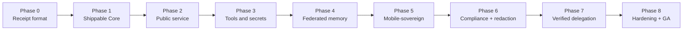

# The Uniclaw Roadmap (8 phases, plain English)

> A guided tour through the receipt-first roadmap. Each phase is one focused goal. We finish a phase before moving to the next.

The full plan lives in `UNICLAW_PLAN.md` §28. This page is the friendly summary.

## Why "receipt-first"?

The order matters. Many AI agent projects build the agent first and bolt on logging afterward. Uniclaw goes the other way. The **first thing** we built was the receipt format. **Then** we built the runtime around it. Why?

Because if the receipt format is wrong, every later piece is built on sand. By making receipts come first, every later step has to *fit* the receipt format — which keeps the whole runtime honest.



## Phase 0 — Receipt-First Foundation ✅ done

**Goal:** define what a receipt looks like, how to sign it, and how to verify it cold.

**What shipped:**

- `RFCS/0001-receipt-format.md` — the human-readable spec for what a receipt is.
- `uniclaw-receipt` crate — Rust types for receipts, plus crypto sign/verify behind a feature flag.
- `uniclaw-verify` — a tiny standalone binary (~720 KB stripped) that takes a receipt JSON file and reports whether it verifies. Has no internet, no database, no dependencies on anything else.

**Why it matters:** before this phase, "verifiable" was a promise. After this phase, you can hand someone a JSON file and a public key, and they can verify it on an offline laptop.

→ See [steps/00-foundation-receipts.md](steps/00-foundation-receipts.md).

## Phase 1 — Shippable Core ✅ done (you are here, just finished)

**Goal:** build the trusted runtime core that produces receipts honestly.

This is the longest phase because it lays in everything the kernel needs: state machine, rules, budgets, approvals, storage, sleep cleanup. It shipped in 8 steps:

1. **Kernel state machine sketch** — the core that turns proposals into receipts.
2. **Constitution engine** — code-based rules separate from the model.
3. **Capability budgets** — algebraic spending limits.
4. **Receipt explainer** — turn receipts into plain English.
5. **Approval engine** — Pending receipts and operator response.
6. **Channel-aware approval routing** — how the operator gets asked.
7. **Receipt store** — chain-validated, issuer-pinned storage.
8. **Light Sleep cleanup** — the first sleep-stage memory pass.

After Phase 1: the trusted core is **internally** complete. You can wire it up and run it. What it cannot yet do is **show itself** to the outside world.

→ See [steps/01-kernel-state-machine.md](steps/01-kernel-state-machine.md) through [steps/08-light-sleep.md](steps/08-light-sleep.md) for one page per step.

## Phase 2 — Public Service 🚧 in progress

**Goal:** make receipts publicly verifiable through a URL.

**What's shipping:**

- ✅ **`uniclaw-host` crate** — an HTTP server that serves any receipt at `/receipts/<hash>`. Step 9. See [steps/09-public-url-hosting.md](steps/09-public-url-hosting.md).
- ✅ **SQLite-backed receipt log** — persistent receipts that survive process restarts. Step 10. See [steps/10-sqlite-receipt-store.md](steps/10-sqlite-receipt-store.md).
- ✅ **Deep Sleep integrity walk** — scheduled `verify_chain()` pass that mints a `$kernel/sleep/deep` audit receipt. Step 11. See [steps/11-deep-sleep.md](steps/11-deep-sleep.md).
- ✅ **HTML verifier UI** — `/verify` page with browser-native Ed25519 verification via `crypto.subtle`. Closes the wedge to non-engineer auditors. Step 12. See [steps/12-html-verifier.md](steps/12-html-verifier.md).
- 🔜 A real, running instance at `https://uniclaw.dev/receipts/...`.
- 🔜 REM Sleep (daily reflection) — blocked on Phase 4 provenance graph + memory subsystems.

**Why it matters:** **this is the wedge made tangible.** Every prior step is infrastructure that you have to read source code to appreciate. Phase 2 is when an auditor on the other side of the world can `curl` a URL and verify a receipt.

## Phase 3 — Tools and Secrets 🚧 in progress

**Goal:** let the agent actually do things, safely.

After studying how the four reference Rust/TypeScript claws (IronClaw, OpenFang, ZeroClaw, OpenClaw) shape their tool-execution architecture, Phase 3 is broken into focused steps. Each is small enough to ship, review, and merge cleanly. (Step 16 split into 16a/16b/16c after wasmtime + Component Model proved heavy enough to warrant separate PRs; the original "six steps" target now becomes eight.)

- ✅ **Step 13 — Tool Execution Foundation.** New `uniclaw-tools` crate: `Tool` trait + `Capability` enum (7 variants, glob-aware) + `ApprovalPolicy` + `ToolHost` registry + `NoopTool` builtin. Kernel: `KernelEvent::RecordToolExecution` mirrors the Approval flow. **No WASM runtime yet** — this is the trait foundation. See [steps/13-tool-foundation.md](steps/13-tool-foundation.md).
- ✅ **Step 14 — Native HTTP Fetch Tool with Capability Enforcement.** New `uniclaw-tools-http` crate: `HttpFetchTool` (synchronous GET via `ureq`), capability-allowlist gate, SSRF refusal of private/loopback/link-local/multicast IPs, bounded response, no auto-redirects. Validates the `Capability` enum + trait surface from step 13 against real network code. Adds `Capability::is_granted_by` helper. See [steps/14-http-fetch-tool.md](steps/14-http-fetch-tool.md). **Reordered from the original plan**: this step was supposed to be WASM, but WASM-with-I/O needs capability enforcement, and capability enforcement needs a real consumer to validate against. Native HTTP first → secrets next → WASM with both already proven.
- ✅ **Step 15 — Secret Broker.** New `uniclaw-secrets` crate: `SecretValue` (drop-zeroizing, redacted Debug, no Serialize/Clone), `SecretBroker` trait, `InMemorySecretBroker` and `EnvSecretBroker` reference impls. `HttpFetchTool` gains `with_broker(...)` and `AuthSpec::BearerHeader { secret_ref }` for fail-closed credential injection. `ToolOutput` gains `metadata.secrets_used`; the kernel mints one `secret_used` provenance edge per consumed reference (name only — never value). See [steps/15-secret-broker.md](steps/15-secret-broker.md).
- ✅ **Step 16a — WASM Tool Runtime skeleton** (this PR). New `uniclaw-tools-wasm` crate: `WasmTool` wraps a `wasmtime::Module` behind the `Tool` trait, applying three independent resource limits — fuel (CPU), memory cap (heap), epoch deadline (wall-clock) — on every call. `ToolError::Timeout` finally has its first real producer. Core wasm only (no Component Model, no host imports, no Rust→WASM build fixture); 16b will layer the Component Model via WIT + `bindgen!`, 16c will add capability-mediated host imports. See [steps/16-wasm-tool-runtime-skeleton.md](steps/16-wasm-tool-runtime-skeleton.md). **Step 16 is split** into 16a/16b/16c so each PR's review surface stays comparable to step 14/15 — wasmtime is a heavy dep and Component Model bindgen has rough edges; landing the runtime first means later failures localise cleanly.
- 🔜 **Step 16b — WASM Component Model.** WIT interface (`wit/tool.wit`) + `wasmtime::component::bindgen!` host glue + a Rust→WASM Component fixture. `WasmTool` API gains `from_component_bytes(...)`. No new resource limits; reuses 16a's runtime infrastructure.
- 🔜 **Step 16c — WASM host imports.** Capability-mediated host functions the guest can call: `http_fetch` (routed through `Capability::is_granted_by` checks), `secret_fetch` (routed through `SecretBroker`). The substrate swap completes: WASM tools become first-class peers of native tools.
- 🔜 **Step 17 — Container Fallback.** Optional second sandbox tier for tools that can't be WASM-compiled. Adopted from OpenClaw's tiered Dockerfile pattern. WASM is the default, container is the escape hatch.
- 🔜 **Step 18 — Output Sanitization / Redaction Proofs.** Response-side leak scanner that looks for secret patterns in tool output and redacts them, with each redaction emitting its own proof receipt.

**Why it matters:** this is where Uniclaw can finally call HTTP, run code, edit files — but with capability budgets enforced *and* with secrets that the model never sees in plaintext.

## Phase 4 — Federated Memory

**Goal:** memory that syncs across your devices, with provenance preserved.

**What ships:**

- CRDT-based memory sync (laptop ↔ phone ↔ server).
- Long-term memory and identity store.
- Vector index (WGSL-accelerated where possible).
- Provenance graph — typed edges between user → model → tool → output, queryable.

**Why it matters:** the agent is not on one device. Memory has to follow you, and the receipts have to follow the memory.

## Phase 5 — Mobile-Sovereign

**Goal:** Android-native, on-device, hardware-attested.

**What ships:**

- Android operator app (primary surface).
- Mobile-local quantized models (`q4_k_m` ≈ 1–3 B parameters on Snapdragon 8 Gen 3+ / Tensor G3+).
- Hardware attestation for sensor inputs (camera, mic, GPS) using the phone's secure enclave.
- Auto-routing between on-device and cloud models based on battery and connectivity.

**Why it matters:** privacy-first agents *cannot* be cloud-only. This is the wedge no other claw is even targeting.

## Phase 6 — Compliance + Provable Redaction

**Goal:** turn the audit chain into something a regulator will accept.

**What ships:**

- Redaction pipeline where each redactor emits its own proof (homomorphic redaction receipt).
- SOC2 / EU AI Act audit packs auto-generated from the receipt chain.
- Retention policy enforcement (configurable by data class).
- Optional ZK receipts for receipts that need to prove a property *without* revealing the underlying data.

**Why it matters:** "we have logs" is not enough. "Here is a cryptographic proof that section 5 of this document was redacted, and the rest is intact" is what regulated industries actually need.

## Phase 7 — Verified Delegation

**Goal:** safely delegate from one agent to another.

**What ships:**

- Multi-agent runtime where every cross-agent message is a signed receipt.
- Capability lease delegation across agents (your budget cannot be exceeded by anything you delegate to).
- Verified MCP bridge with streaming (fixes IronClaw's gap).
- Compatibility layers for OpenClaw, ZeroClaw, NanoClaw, IronClaw, OpenFang.

**Why it matters:** real-world agentic workflows involve agents calling other agents. Today that's a security disaster. With Uniclaw's budget algebra and signed inter-agent receipts, it stops being one.

## Phase 8 — Hardening + GA

**Goal:** general availability.

**What ships:**

- Formal verification of the kernel's state machine.
- Reproducible builds for the verifier and kernel.
- Threat-model document and red-team bug bounty.
- Stable wire-format guarantees for receipts.
- Versioned receipt format with backwards-compat through Phase 9.

**Why it matters:** at GA, "what runs in production" must be a thing you can audit, formally, top to bottom. This phase gets us there.

## Where we are right now

```
Phase 0 ✅ done
Phase 1 ✅ done
Phase 2 ✅ wedge-complete (steps 9 + 10 + 11 + 12 landed; deployment is ops, not code)
Phase 3 🚧 in progress (steps 13 + 14 + 15 + 16a landed)  ← you are here
Phase 3 ⬜ planned
Phase 4 ⬜ planned
Phase 5 ⬜ planned
Phase 6 ⬜ planned
Phase 7 ⬜ planned
Phase 8 ⬜ planned
```

The repo on GitHub will always have an up-to-date `CHANGELOG.md` showing every shipped step. The master plan (`UNICLAW_PLAN.md`) holds the canonical detailed version of this roadmap.

## How to follow along

- **Read the [step docs](steps/)** — one page per shipped step, in plain English.
- **Watch GitHub** — every step lands as a PR with a verification gate (build + test + clippy + benchmark).
- **Check `CHANGELOG.md`** — always reflects what is on `main`.
